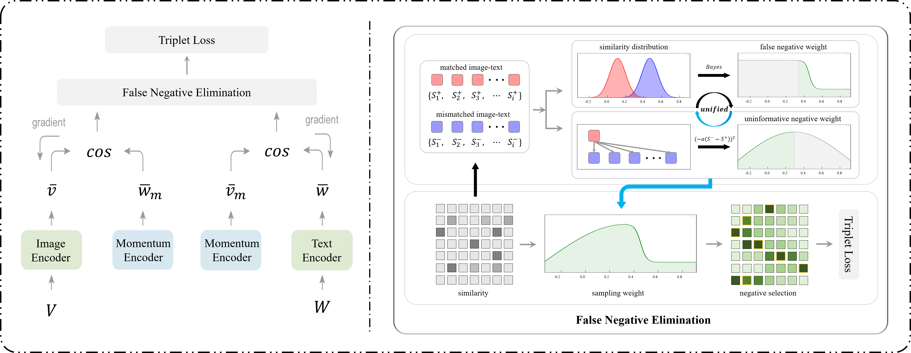

# FNE
Implementation of our paper, "[Your Negative May not Be True Negative: Boosting Image-Text Matching with False Negative Elimination](https://arxiv.org/abs/2308.04380)".

## Introduction
Most existing image-text matching methods adopt triplet loss as the optimization objective, and choosing a proper negative sample for the triplet of <anchor, positive, negative> is important for effectively training the model, e.g., hard negatives make the model learn efficiently and effectively. However, we observe that existing methods mainly employ the most similar samples as hard negatives, which may not be true negatives. In other words, the samples with high similarity but not paired with the anchor may reserve positive semantic associations, and we call them *false negatives*. Repelling these false negatives in triplet loss would mislead the semantic representation learning and result in inferior retrieval performance. In this paper, we propose a novel **False Negative Elimination (FNE)** strategy to select negatives via sampling, which could alleviate the problem introduced by false negatives. Specifically, we first construct the distributions of positive and negative samples separately via their similarities with the anchor, based on the features extracted from image and text encoders. Then we calculate the false negative probability of a given sample based on its similarity with the anchor and the above distributions via the Bayes' rule, which is employed as the sampling weight during negative sampling process. Since there may not exist any false negative in a small batch size, we design a memory module with momentum to retain a large negative buffer and implement our negative sampling strategy spanning over the buffer. In addition, to make the model focus on hard negatives, we reassign the sampling weights for the simple negatives with a cut-down strategy. To evaluate the effectiveness of our proposed method, we conduct extensive experiments on Flickr30K and MS-COCO benchmarks, and the results demonstrate the superiority of our proposed false negative elimination strategy.



## Requirements 
We recommended the following dependencies.

* Python 3.8 
* [PyTorch](http://pytorch.org/) (1.8.1)
* [NumPy](http://www.numpy.org/) (>=1.23.4)
* [transformers](https://huggingface.co/docs/transformers) (4.21.2)
* [torchvision]()

## Download data and pretrained model

The raw images can be downloaded from their original sources [here](http://shannon.cs.illinois.edu/DenotationGraph/) and [here](http://mscoco.org/). We will use the [json](https://drive.google.com/drive/folders/1mondFS6TCbzvz2ZUk4UDFAxnD8xk25ie?usp=drive_link) files to leverage these data.

We refer to the path of extracted files as `$DATA_PATH`. 

If you don't want to train from scratch, you can download the pretrained FNE model from [here](https://drive.google.com/file/d/1dh1rS3ttv-fGudx9jsLTJQtM3D7WLztz/view?usp=drive_link)  (for Flickr30K model) and [here](https://drive.google.com/file/d/1_m2b4ufECm3vMGu6vI38fJQ1q4aYZYfo/view?usp=drive_link) (for MSCOCO model).

## Train new models
Run `train.py`:

For FNE on Flickr30K:

```bash
python train.py --data_path $DATA_PATH/f30k/images  --logger_name runs/flickr_FNE --dataset flickr --max_violation
```

For FNE on MSCOCO:

```bash
python train.py --data_path $DATA_PATH/coco/images  --logger_name runs/mscoco_FNE --dataset mscoco --max_violation
```


## Evaluate trained models

Test on Flickr30K:

```bash
python train.py --data_path $DATA_PATH/f30k/images  --logger_name runs/flickr_FNE --dataset flickr --max_violation --test
```

Test on MSCOCO:

```bash
python train.py --data_path $DATA_PATH/coco/images  --logger_name runs/mscoco_FNE --dataset mscoco --max_violation --test
```


## Reference

```
@inproceedings{li2023your,
  title={Your negative may not be true negative: Boosting image-text matching with false negative elimination},
  author={Li, Haoxuan and Bin, Yi and Liao, Junrong and Yang, Yang and Shen, Heng Tao},
  booktitle={Proceedings of the 31st ACM International Conference on Multimedia},
  pages={924--934},
  year={2023}
}
```
